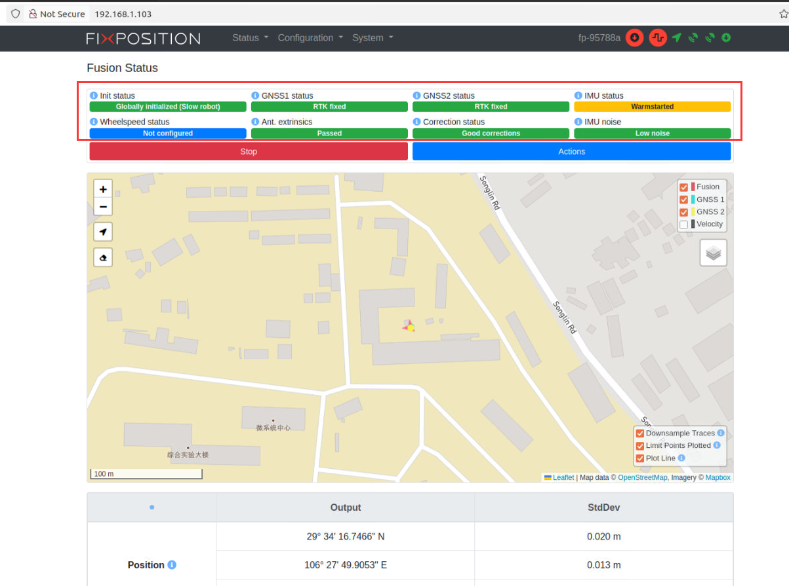

# 数据采集一键启动包
    适用于jetson agx orin(jectpack 5.1.2)。
    
## 1.使用方法
    下载后，删除编译的 devel 和 build 目录重新编译，编译命令为：catkin build fixposition_driver_ros1 rslidar_sdk zed_wrapper
    编译成功后，在当前工作目录下，执行如下命令：
    source ./devel/setup.bash
    roslaunch ./launch/data_get_main.launch
    便可一键启动数据采集。

## 2.查看是否能成功采集数据
    从浏览器进入 192.168.1.103 ，观察下方8个长条，不能出现红色长条
    
